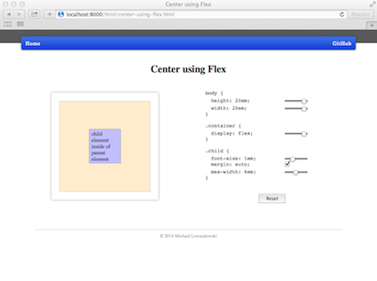

### What is css-lab?
A very small interactive CSS playground:




### Where is it?

[Here](http://milewdev.github.io/css-lab/).


### Development Setup

#####Requirements:
- [OS X](https://www.apple.com/osx/)
- [VMware Fusion](http://www.vmware.com/ca/en/products/fusion)
- [Vagrant](http://www.vagrantup.com)
- [Vagrant VMware provider](https://www.vagrantup.com/vmware)
- An OS X Vagrant box named OSX109 (you can use a different name by changing the BOX variable near the top of the Vagrantfile downloaded in the Install step below)


#####Install:

In a terminal window on the host machine:
```
$ mkdir -p ~/work/css-lab
$ cd ~/work/css-lab
$ curl -fsSL https://raw.github.com/milewdev/css-lab/gh-pages/Vagrantfile -o Vagrantfile
$ vagrant up --provider=vmware_fusion
...
```

#####Check installation:

In a terminal window on the vm (guest machine):
```
$ cd ~/Documents/css-lab
$ ./_run_local_server
Running "serve" task

Running "clean" task

Running "sass:dist" (sass) task

Running "autoprefixer:dist" (autoprefixer) task
File css/library.css created.
File css/style.css created.

Running "coffee:compile" (coffee) task
>> 1 files created.

Running "connect:livereload" (connect) task
Started connect web server on http://localhost:8000

Running "watch" task
Waiting...
```

Open a browser on the vm and go to http://localhost:8000.


#####Uninstall:

**WARNING**: This will completely destroy the vm so you likely want to ensure that you have
pushed any and all code changes to GitHub beforehand.

In a terminal window on the host machine:
```
$ cd ~/work/css-lab
$ vagrant destroy -f
$ cd ~
$ rm -r ~/work/css-lab    # and possibly rm -r ~/work if it is now empty
```


#####Development Notes:

- ./_build will build the site by running CoffeeScript and SASS compilers.

- ./_run_local_server will launch a webserver at localhost:8000.

- If you wish to modify the Vagrantfile, it is best to do so on the host machine (~/work/css-lab/Vagrantfile)
so that you can easily do an edit/vagrant up/vagrant destroy cycle.  Once you have finished making
changes, vagrant up and then in a terminal window on the vm do something like:
    ```
    $ cd ~/Documents/css-lab
    $ cp /vagrant/Vagrantfile .
    $ git status
    ...
    $ git add Vagrantfile
    $ git commit -S -m "Insert description of change to Vagrantfile here."
    ...
    $ git push
    ...
    ```


### Thanks

- [Apple](http://www.apple.com)
- [Atom](https://atom.io)
- [Bundler](http://bundler.io)
- [CoffeeScript](http://coffeescript.org)
- [GitHub](https://github.com) and [GitHub pages](http://pages.github.com)
- [Grunt](http://gruntjs.com)
- [Jekyll](http://jekyllrb.com)
- [jQuery](http://jquery.com)
- [Sass](http://sass-lang.com)
- [TextMate](http://macromates.com)
- [Vagrant](https://www.vagrantup.com)
- [VMware](http://www.vmware.com)
