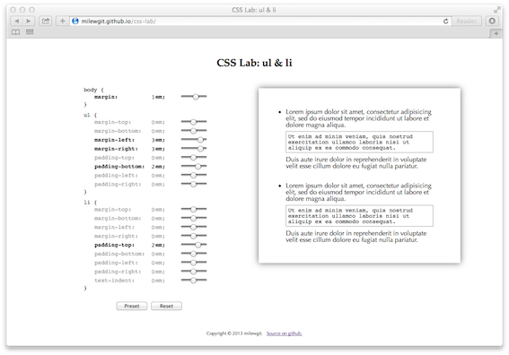

### css-lab

  
#### What is it?
A very small interactive CSS playground (currently only ul & li margins and padding):




#### Where is it?
  
[Here](http://milewgit.github.io/css-lab/).


#### Development Setup

Requirements:
- [OS X](https://www.apple.com/osx/)
- [VMware Fusion](http://www.vmware.com/ca/en/products/fusion)
- [Vagrant](http://www.vagrantup.com)
- [Vagrant VMware provider](https://www.vagrantup.com/vmware)


Install:

In a terminal window on the host machine:
```
$ mkdir -p ~/work/css-lab
$ cd ~/work/css-lab
$ curl -fsSL https://raw.github.com/milewgit/css-lab/gh-pages/Vagrantfile -o Vagrantfile
$ vagrant up --provider=vmware_fusion
...
```

Check install:

In a terminal window on the vm (guest machine):
```
$ cd ~/Documents/css-lab
$ ./watch
Started local web server at http://localhost:4000 and now watching for changes.
Press Ctrl-C to stop.

```

Open a browser on the vm and go to http://localhost:4000.


Uninstall:

WARNING: This will completely destroy the vm so you likely want to ensure that you have 
pushed any and all code changes to GitHub beforehand.

In a terminal window on the host machine:
```
$ cd ~/work/css-lab
$ vagrant destroy -f
$ cd ~
$ rm -r ~/work/css-lab    # and possibly rm -r ~/work if it is now empty
```


Development Notes:

- ./watch is a shell script that will launch both Sass and Jekyll in watch mode.  Run ./watch and
launch a browser pointing to http://localhost:4000.  As you make and save changes to the source 
files (e.g. index.html, script.js, style.scss), simply refresh the browser (Command-R, etc.)
to immediately see the results of your changes.

- You can launch a browser on the vm and point to http://localhost:4000 but you can also launch
a browser on the host and point to http://localhost:4000.  This is due to some port mapping that
is done in the Vagrantfile.  More useful is that you can point to your host machine from your
tablet's browser to see how the site looks from there.  In this case the address will be something
like http://192.168.1.123:4000.

- ./build will invoke Sass to convert .scss files to .css files.  If you do not use ./watch, make
sure you use ./build instead otherwise the .css files will get out of sync with the .scss files.
  
- If you wish to modify the Vagrantfile, it is best to do so on the host machine (~/work/css-lab/Vagrantfile) 
so that you can easily test them with an edit/vagrant up/vagrant destroy cycle.  Once you have finished making 
changes, vagrant up and then in a terminal window on the vm do something like:
```
$ cd ~/Documents/css-lab
$ cp /vagrant/Vagrantfile .
$ git status
...
$ git add Vagrantfile
$ git commit -S -m "Insert description of change to Vagrantfile here."
...
$ git push
...
```


#### Thanks

- [Apple](http://www.apple.com)
- [GitHub](https://github.com) and [GitHub pages](http://pages.github.com)
- [Bundler](http://bundler.io)
- [Jekyll](http://jekyllrb.com)
- [jQuery](http://jquery.com)
- [Sass](http://sass-lang.com)
- [TextMate](http://macromates.com)
- [Vagrant](https://www.vagrantup.com)
- [VMware](http://www.vmware.com)
